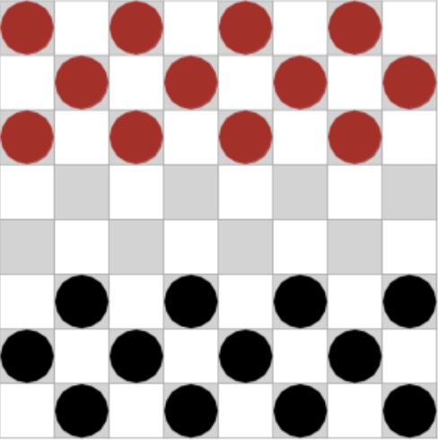

# Checkers

a graphical game of Checkers (AKA Draughts)

## Checkers Rules

The game is played with black and red pieces on an 8x8 board with light and dark squares in a checkerboard pattern. The goal of the game is to capture all of your opponent’s pieces. Play begins with both players’ pieces arranged like this:

### Making moves

A turn consists of moving one of the player’s own pieces. Pieces may only be moved diagonally and in a forward direction, with one exception (see “King pieces” below). “Forward” means from the player’s start side to the opposite side—red pieces move from the top of the board to the bottom, and black pieces move from the bottom to the top. There are two types of move a piece can make:

- **Non-capturing move**. A piece is moved diagonally forward one square. The square that the piece is moved to must be empty.
- **Capturing move**. If an enemy piece is next to the player’s piece, and the next square in the same direction is empty, the enemy piece can be captured as long as the move is in a forward direction. The captured piece is removed from the board.

If a capture is possible, it must be made. In the example above, the only legal move for red was to capture the black piece, even though this ultimately sacrificed red’s own piece.
Sometimes it’s possible to make multiple captures in a single move. Jumps can change diagonal direction, as long as the capturing piece continues forward.

The two types of moves cannot be combined. For example, it is not possible to make a non- capturing move and continue on to make a capturing move in the same turn.

### King pieces

When a piece gets all the way to the opposite side of the board, it is crowned a King. King pieces are very useful because they can move backwards as well as forwards. Moves are still diagonal. In “real” checkers, a King is made by stacking two pieces together. In my Python version of checkers, I identify King pieces with a white ring on the piece.

### Ending the game

CS5001 Seattle Fall 2021
After the capture is made, the black piece reaches the top and is crowned a King. Notice the white ring on the King piece.
The game ends when a player has captured all enemy pieces (most common), or when one of the players is not able to move their remaining pieces.

## Project Implementation

- Display a board with an 8 x 8 checkerboard pattern made up of light and dark squares.
- Each player starts with 12 pieces, arranged as shown in the first image in this document. Black and red are the traditional colors.
- Moves must follow the rules above. If a capturing move is available, the player MUST make that move. If multiple capturing moves are available, it doesn’t matter which one is chosen, as long as a capture is made. If, after a player has captured an enemy piece, another capture is possible for the same piece, that capture must also be made.
- When a capture is made, the captured piece must be removed from the board.
- When a piece reaches the opposite side, it should be made into a King piece.
- King pieces should be visually distinguishable from “normal” pieces.
  One player is a (human) user, the other player is the computer. The human user
  should make the first move. In the traditional colors, black will be human. When it’s the computer’s turn, the program will identify all legal moves and pick one to make. If a capturing move is available, it must be made.
- The user should make moves by clicking on the square containing the piece they would like to move, then clicking on the square the piece should be moved to. Only allow a move to be made if it is valid according to the rules above. If the user attempts an invalid move (e.g. clicking on an empty square or an enemy’s piece etc.), provide some feedback. Printing a message to the terminal counts as feedback.
- When the game is over, declare the winner and stop the game play.

## Usage

Run the main.py

## Explaination

see unit tests in test_gamestate.py, run pytest on it
